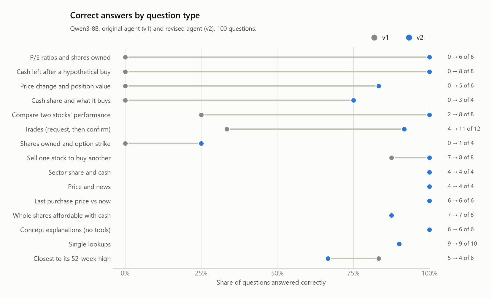
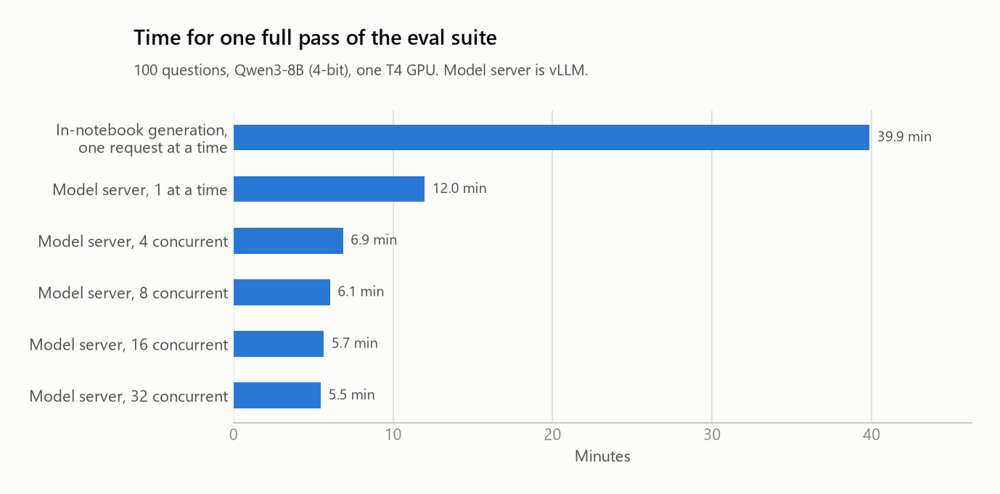
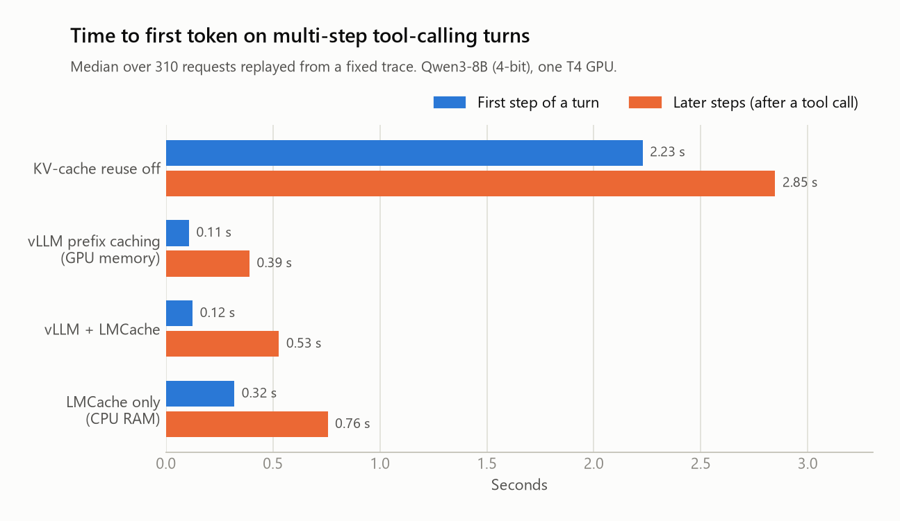
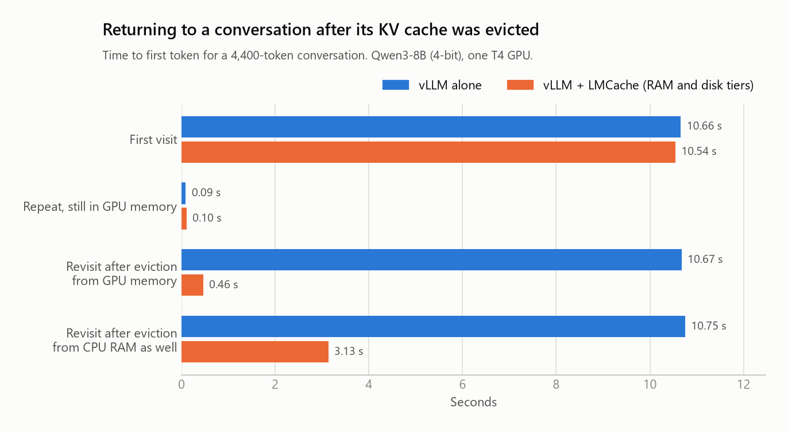

# Portfolio Assistant

A virtual assistant for a personal investment portfolio, built on open-weights
Qwen3 models (0.6B and 8B). It answers questions about an account, looks up
market data, analyzes the portfolio, explains financial concepts, and places
trades behind guardrails. Every number in an answer comes from a tool result,
not from the model's memory.

```
You:        How many whole shares of META could I buy with my available cash
            at its current price?
Assistant:  [calls get_user_info, then get_stock_price("META")]
            With your available cash of $15,420.50 and the current price of META
            at $730.04, you could buy approximately 21 whole shares.
```

## What it can do

| Area | Examples |
|---|---|
| Account | Cash balance, holdings, cost basis, recent trades |
| Market data | Prices, 52-week range, option chains, news, price history |
| Portfolio analysis | Total value and P&L, sector allocation, side-by-side stock comparison |
| Education | Explains concepts such as covered calls or P/E ratio, without calling tools |
| Trading | Buys and sells, market or limit orders, only after the user confirms |

## How it works

**Data layer.** A SQLite database holds the user, holdings and transaction
history, seeded with a mock portfolio of ten positions. Market data comes from
yfinance.

**Tools.** The model reaches the data through 13 tools, each described to it as
a JSON schema:

| Group | Tools |
|---|---|
| Account | `get_user_info`, `get_holdings`, `get_holding_by_ticker`, `get_recent_transactions` |
| Market data | `get_stock_price`, `get_option_chain`, `get_stock_news`, `get_historical_data` |
| Analysis | `get_portfolio_summary`, `get_sector_allocation`, `compare_stocks` |
| Web | `web_search` |
| Trading | `execute_trade` |

**Agent loop.** The model reads the question and either answers or asks for
tools. The tool results are appended to the conversation and the model is
called again, for up to five rounds (`agent/agent.py`).

**Trade guardrails.** The code enforces the rules regardless of what the model
does: at most 500 shares per order, no restricted tickers, no buying beyond the
cash balance, no selling more than is held. It also enforces confirmation: a
trade only executes if the model proposed the same trade in an earlier turn, so
the user always gets to reply first. The first call returns a preview with the
estimated cost instead (`agent/agent.py`).

**Two model sizes.** Qwen3-0.6B and Qwen3-8B run the same agent, so the effect
of model size on tool use and answer quality can be compared directly. The 8B
model is 4-bit quantized so it fits on a 16 GB GPU.

## Evaluation

A 100-question suite, 84 of them multi-step (two or more tool calls, or a
two-turn trade that must wait for confirmation):

| Kind | Count | Example |
|---|---|---|
| Single lookup | 10 | "What is the current price of NVDA?" |
| Educational (must use no tools) | 6 | "What is dollar-cost averaging?" |
| Multi-tool | 72 | "How many whole shares of META could I buy with my available cash at its current price?" |
| Trades (request, then confirm) | 12 | "Buy 5 shares of MSFT." / "Buy 1000 shares of NVDA." (must be refused) |

A question is a **correct completion** only if the agent called the right tools,
called no forbidden tool, gave an answer containing the expected numbers, and
(for trades) waited for confirmation and left the database in the expected
state. Scoring is deterministic; see `eval/score.py`.

The agent has two versions (`agent/prompts.py`). **v1** is the original system
prompt and tool descriptions. **v2** was written after reading the v1 failures:
trades executed without confirmation, replies that announced a lookup and then
stopped, tools that could not answer the question, and invented numbers. It
rewrites the prompt and tool descriptions and adds the confirmation gate above.

Three choices keep the suite repeatable:

- **Recorded market data.** Live prices change every minute, so evals read a
  snapshot of the tool outputs for 18 tickers (`data/market_snapshot.json`).
- **Computed answers.** `eval/build_questions.py` works out every expected
  number by calling the same tool functions the agent uses.
- **Two halves.** Questions alternate between two halves inside every category,
  and every run reports each half, so a gain can be checked on both.

## Latency

The original version of this project called `model.generate()` inside a
notebook, one request at a time. Two things make the assistant faster.

**Serving the model behind an API.** The agent talks to an OpenAI-compatible
endpoint, and the model runs in a separate server (vLLM). The server batches
concurrent requests on the GPU, so the eval suite can run many questions at
once instead of one after another. SGLang exposes the same API and is included
as an alternative backend; switching is a `--base-url` change.

**Reusing the KV cache.** Every request starts with the same system prompt and
13 tool schemas, and each step of a tool-calling turn repeats everything before
it. A server that keeps the KV cache of text it has already processed skips
that work, which lowers time-to-first-token. vLLM does this in GPU memory;
LMCache extends it to CPU RAM and local disk, so a prefix that was pushed out
of GPU memory is loaded back instead of recomputed.

Time-to-first-token is measured by replaying a fixed trace
(`bench/trace.jsonl`): the 100 eval conversations with the ideal tool calls
already made, so every setup is timed on exactly the same prompts.

## Results

Measured on one free Colab T4 GPU with Qwen3-8B (4-bit) unless noted. The raw
records and summaries are in `results/`; `scripts/make_figures.py` draws the
charts from them.

### Answer quality

| Correct completions | v1 | v2 |
|---|---|---|
| Qwen3-8B, all 100 questions | 54 | 90 |
| Qwen3-8B, first half / second half | 28 / 26 | 48 / 42 |
| Qwen3-8B, the 84 multi-step questions | 39 | 75 |
| Qwen3-8B, the 12 trades | 4 | 11 |
| Qwen3-0.6B, all 100 questions | 16 | 19 |



- **What v1 got wrong.** It executed 7 of the 12 trades without waiting for
  confirmation, even though its prompt said to wait. On several question types
  it announced a lookup and stopped, picked a tool that could not answer, or
  made up a P/E ratio.
- **What v2 still gets wrong.** Mostly arithmetic slips (180 instead of 179
  shares) and answers that skip one of two things asked for.
- **Model size matters more than the prompt.** The 0.6B model rarely chains two
  tool calls, and the v2 changes barely help it.
- v2 was written after reading v1 failures from across the whole suite, so 90
  is not a held-out score.

### Latency

**Full pass of the eval suite** (agent v1):

| Setup | Full pass | Speed-up |
|---|---|---|
| In-notebook generation, one request at a time | 39.9 min | 1.0x |
| Model server (vLLM), one request at a time | 12.0 min | 3.3x |
| Model server (vLLM), 32 concurrent requests | 5.5 min | 7.3x |



Most of the gain comes from the serving engine itself; concurrency adds another
2.2x on top. The 12 trades always run one at a time and cost a fixed 78
seconds, which caps what concurrency can do; the read-only questions alone go
from 10.7 to 4.2 minutes (2.6x). The in-notebook baseline uses a different 4-bit
format (bitsandbytes rather than AWQ), so this compares two whole setups, not
one setting.

**Time to first token**, replaying the fixed trace of 310 requests:

| Setup | Median | First step of a turn | Later steps |
|---|---|---|---|
| KV-cache reuse off | 2.63 s | 2.23 s | 2.85 s |
| vLLM prefix caching (GPU memory) | 0.32 s | 0.11 s | 0.39 s |
| vLLM + LMCache | 0.34 s | 0.12 s | 0.53 s |
| LMCache only (CPU RAM) | 0.51 s | 0.32 s | 0.76 s |



Reusing the KV cache of the shared system prompt and tool schemas cuts the
median time to first token about 8x. While a prefix is still in GPU memory,
adding LMCache gains nothing and costs a little; on its own, serving the same
prefixes from CPU RAM, it is still 5x faster than recomputing.

**Coming back to a conversation after its cache was evicted.** A 4,400-token
conversation is sent, pushed out of GPU memory by unrelated prompts, and sent
again:

| Time to first token | vLLM alone | vLLM + LMCache |
|---|---|---|
| First visit | 10.66 s | 10.54 s |
| Repeat, still in GPU memory | 0.09 s | 0.10 s |
| Revisit after eviction from GPU memory | 10.67 s | 0.46 s (loaded from CPU RAM) |
| Revisit after eviction from CPU RAM as well | 10.75 s | 3.13 s (loaded from disk) |



This is where the extra cache tiers pay off. The conversation's KV cache is
0.6 GB. Loading it back from RAM takes milliseconds; loading it from Colab's
disk takes about 2.7 seconds (roughly 0.2 GB/s), which is nearly all of the
3.13 s. On this setup the time to first token after a disk hit is set by
storage read speed. The disk row is a single measurement per setup; LMCache
running inside the vLLM process gave 3.02 s.

To make eviction happen in a short test, the GPU KV cache was capped at 2 GB
(about 14,500 tokens) in every time-to-first-token and eviction run.

**Alternative backend.** SGLang ran the same suite with no code change.
Handling one request at a time it generated about 6 tokens/s against vLLM's 24,
and its log warns that this 4-bit format is not optimized there. With 16
concurrent requests its read-only pass took 3.8 minutes against vLLM's 4.4. It
also reuses prefixes automatically (median time to first token 0.38 s). Its
tool-call formatting differs slightly, and with agent v1 it scored 41 where
vLLM scored 49 under the scorer used for those two runs.

## Repository layout

| Folder | Contents |
|---|---|
| `agent/` | Database, market data, tools, trade guardrails, agent loop, prompts, model backends |
| `eval/` | Question builder, the 100 questions, scorer, runner |
| `results/` | Raw records, summaries and figures from the runs below |
| `bench/` | Fixed trace, time-to-first-token and KV-cache benchmarks |
| `serving/` | Launch scripts for the model servers |
| `notebooks/` | Colab notebooks that run each experiment on a T4 GPU |
| `data/` | Recorded market data snapshot |
| `tests/` | Tests that run without a GPU |

## Running it

The experiments run on a free Colab T4. Open a notebook in Colab, pick the T4
GPU runtime, and choose Runtime > Run all. The first cell clones this repo.

| Notebook | What it does |
|---|---|
| [`00_smoke_test`](https://colab.research.google.com/github/sauerpatchkid/Portfolio_Assistant/blob/main/notebooks/00_smoke_test.ipynb) | Checks that each model server starts and handles a tool call |
| [`01_eval_vllm`](https://colab.research.google.com/github/sauerpatchkid/Portfolio_Assistant/blob/main/notebooks/01_eval_vllm.ipynb) | Eval suite on both models, and full-pass time at 1 to 32 concurrent requests |
| [`02_kv_cache`](https://colab.research.google.com/github/sauerpatchkid/Portfolio_Assistant/blob/main/notebooks/02_kv_cache.ipynb) | Time-to-first-token with KV-cache reuse off, on, and extended to RAM and disk; eviction test |
| [`03_sglang`](https://colab.research.google.com/github/sauerpatchkid/Portfolio_Assistant/blob/main/notebooks/03_sglang.ipynb) | Same eval suite and trace on the alternative backend |
| [`04_hf_baseline`](https://colab.research.google.com/github/sauerpatchkid/Portfolio_Assistant/blob/main/notebooks/04_hf_baseline.ipynb) | Same suite through sequential in-notebook generation |
| [`05_agent_versions`](https://colab.research.google.com/github/sauerpatchkid/Portfolio_Assistant/blob/main/notebooks/05_agent_versions.ipynb) | Agent v1 vs v2 on both models |

Against any running OpenAI-compatible server:

```bash
python -m eval.run_eval --name my_run --model Qwen/Qwen3-8B-AWQ --base-url http://localhost:8000/v1 --prompt v2 --concurrency 16
```

Tests, no GPU needed:

```bash
python -m pytest
```

## Limitations

- One T4 GPU and one quantized model; timings will not transfer to other hardware.
- Each timing is a single run. The eval is deterministic (same answers at every
  concurrency), but wall-clock times on a shared Colab GPU vary between sessions.
- Scoring is keyword- and number-based, so it can miss a correct answer phrased
  unusually, or accept a wrong one that happens to contain the right number.
- The benchmark trace uses ideal tool calls, not a model's own.
- The portfolio is mock data and the market data is a snapshot from one day.
